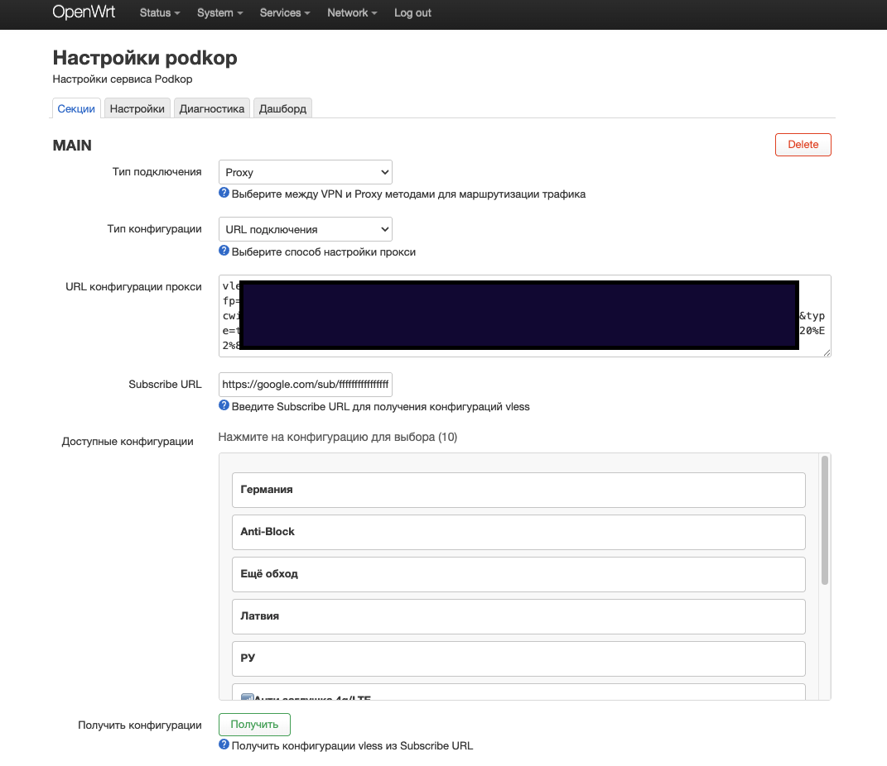

# luci-podkop-subscribe



Расширение LuCI для Podkop, добавляющее функциональность Subscribe URL для получения и управления конфигурациями прокси.

**Поддерживаемые протоколы:** VLESS, Shadowsocks (SS), Trojan, Hysteria2 (hy2)

## Быстрая установка

```bash
sh <(wget -O - https://raw.githubusercontent.com/mr-Abdrahimov/luci-podkop-subscribe/main/install.sh)
```

## Удаление

```bash
sh <(wget -O - https://raw.githubusercontent.com/mr-Abdrahimov/luci-podkop-subscribe/main/uninstall.sh)
```

## Описание

Этот плагин расширяет интерфейс LuCI Podkop функцией Subscribe, которая позволяет пользователям:

- Вводить Subscribe URL, содержащий конфигурации в формате base64
- Получать конфигурации из Subscribe URL одним нажатием кнопки
- Просматривать доступные конфигурации в удобном списке с указанием протокола
- Выбирать и применять конфигурации к настройкам прокси Podkop или напрямую к Xray
- Автоматически сохранять Subscribe URL в конфигурации (сохраняется при Save & Apply)
- Поддержка светлой и тёмной темы LuCI

---

## 📋 Режим 1: Connection URL

Режим "Connection URL" позволяет получать конфигурации из Subscribe URL и применять их напрямую к настройкам прокси Podkop.

### Возможности

- **Поле Subscribe URL**: Поле ввода для ввода ссылок подписки
- **Получить конфигурации**: Кнопка для получения и парсинга конфигураций VLESS
- **Список конфигураций**: Отображает доступные конфигурации с их названиями
- **Выбор одним кликом**: Клик по конфигурации применяет её к настройкам прокси Podkop
- **Автосохранение**: Subscribe URL автоматически сохраняется и восстанавливается
- **Умная видимость**: Список конфигураций появляется только когда Тип подключения установлен в "Proxy" и Тип конфигурации в "Connection URL"

### Как использовать

1. Перейдите в: **LuCI -> Services -> Podkop**
2. Установите **Connection Type** в **"Proxy"**
3. Установите **Configuration Type** в **"Connection URL"**
4. В поле **"Subscribe URL"** вставьте ссылку на подписку (формат base64 с конфигурациями VLESS)
5. Нажмите кнопку **"Получить"**
6. В списке ниже появятся доступные конфигурации с их названиями
7. Кликните по нужной конфигурации — она будет применена к полю "Proxy Configuration URL"
8. Сохраните настройки Podkop

### Как это работает

1. Пользователь вводит Subscribe URL в поле "Subscribe URL"
2. Нажимает кнопку "Получить"
3. Плагин получает содержимое URL (ожидается данные в формате base64)
4. Декодирует данные base64 и парсит URL VLESS
5. Отображает конфигурации в списке ниже поля Subscribe URL
6. Пользователь кликает по конфигурации для применения её к настройкам прокси Podkop
7. Subscribe URL автоматически сохраняется для будущего использования

---

## 🚀 Режим 2: Outbound Config (Xray)

Режим "Outbound Config" позволяет получать конфигурации из Subscribe URL и применять их напрямую к Xray, минуя настройки Podkop. Это особенно полезно для работы с VLESS+XHTTP+REALITY.

### Требования

- **xray-core** должен быть установлен:
  ```bash
  opkg update
  opkg install xray-core
  ```
- Файл `/etc/xray/config.json` должен быть доступен для записи
- Служба Xray должна быть настроена и запущена

### Возможности

- **Поле Subscribe URL**: Поле ввода для Subscribe URL (такое же, как в режиме Connection URL)
- **Получить конфигурации**: Кнопка для получения списка конфигураций VLESS
- **Список конфигураций**: Отображает доступные конфигурации
- **Прямое применение к Xray**: Клик по конфигурации:
  - Парсит VLESS URL и преобразует в конфигурацию Xray
  - Создает/обновляет файл `/etc/xray/config.json`
  - Автоматически перезапускает службу Xray
- **Поддержка всех параметров VLESS**: 
  - Поддержка типов сети: `tcp`, `ws`, `xhttp` и других
  - Поддержка безопасности: `tls`, `reality`
  - Поддержка параметров REALITY: `serverName`, `fingerprint`, `publicKey`, `shortId`, `spiderX`
  - Поддержка xhttpSettings: `host`, `path`, `mode`
  - Поддержка WebSocket: `path`, `host`

### Установка и настройка Xray (если еще не установлен)

#### 1. Установка пакетов

```bash
opkg update
opkg install xray-core nano
```

#### 2. Создание службы автозапуска

```bash
cat > /etc/init.d/xray << 'EOF'
#!/bin/sh /etc/rc.common

START=99
USE_PROCD=1
PROG=/usr/bin/xray

validate_config() {
    $PROG -test -config /etc/xray/config.json >/dev/null 2>&1
}

start_service() {
    validate_config || {
        echo "Xray: invalid config"
        return 1
    }
    procd_open_instance
    procd_set_param command $PROG -config /etc/xray/config.json
    procd_set_param respawn 60 5 5
    procd_set_param user root
    procd_set_param stdout 1
    procd_set_param stderr 1
    procd_close_instance
}
EOF

chmod +x /etc/init.d/xray
/etc/init.d/xray enable
```

#### 3. Проверка работы службы

```bash
/etc/init.d/xray start
/etc/init.d/xray status
```

Должно показать: `running`

### Как использовать

1. Перейдите в: **LuCI -> Services -> Podkop**
2. Установите **Connection Type** в **"Proxy"**
3. Установите **Configuration Type** в **"Outbound Config"**
4. В поле **"Subscribe URL"** вставьте ссылку на подписку
5. Нажмите кнопку **"Получить"**
6. В списке ниже появятся доступные конфигурации
7. Кликните по нужной конфигурации:
   - Плагин автоматически сгенерирует конфигурацию Xray
   - Сохранит её в `/etc/xray/config.json`
   - Перезапустит службу Xray
8. Подключите Podkop к Xray через SOCKS прокси

### Как это работает

1. Пользователь выбирает "Outbound Config" в поле "Configuration Type"
2. Вводит Subscribe URL в поле "Subscribe URL"
3. Нажимает кнопку "Получить"
4. Плагин получает и парсит конфигурации VLESS (как в режиме Connection URL)
5. Отображает список конфигураций
6. При клике на конфигурацию:
   - Парсится VLESS URL и извлекаются все параметры (uuid, host, port, security, network и т.д.)
   - Генерируется полная конфигурация Xray в формате JSON
   - Сохраняется в `/etc/xray/config.json` со следующей структурой:
     - `log`: настройки логирования
     - `inbounds`: SOCKS прокси на порту 10808
     - `outbounds`: конфигурация VLESS из выбранной ссылки, плюс `direct` и `block` outbounds
     - `routing`: правила маршрутизации для направления трафика через прокси
   - Автоматически перезапускается служба Xray командой `/etc/init.d/xray restart`
7. Subscribe URL автоматически сохраняется для будущего использования

### Подключение Podkop к Xray

После применения конфигурации Xray будет доступен на `127.0.0.1:10808` через SOCKS5.

В Podkop используйте следующую конфигурацию в поле **"Outbound Configuration"**:

```json
{
  "type": "socks",
  "tag": "vless-xhttp",
  "server": "127.0.0.1",
  "server_port": 10808
}
```

Затем настройте маршрутизацию в Podkop (Geosite / Geoblock / Custom Rules) с Outbound: `vless-xhttp`.

### Проверка работы

```bash
# Проверка статуса Xray
/etc/init.d/xray status

# Проверка конфигурации
xray -test -config /etc/xray/config.json

# Тест подключения через Xray
curl --socks5 127.0.0.1:10808 https://ifconfig.me

# Просмотр логов
logread | grep xray | tail -10
```

### Формат конфигурации Xray

При использовании режима "Outbound Config" создается конфигурация следующего формата:

```json
{
  "log": { "loglevel": "warning" },
  "inbounds": [
    {
      "tag": "socks-local",
      "port": 10808,
      "listen": "127.0.0.1",
      "protocol": "socks",
      "settings": { "udp": true },
      "sniffing": {
        "enabled": true,
        "destOverride": ["tls", "http", "quic"]
      }
    }
  ],
  "outbounds": [
    {
      "tag": "proxy",
      "protocol": "vless",
      "settings": { ... },
      "streamSettings": { ... }
    },
    { "tag": "direct", "protocol": "freedom", "settings": {} },
    { "tag": "block", "protocol": "blackhole", "settings": { "response": { "type": "none" } } }
  ],
  "routing": {
    "rules": [
      {
        "type": "field",
        "inboundTag": ["socks-local"],
        "outboundTag": "proxy"
      }
    ]
  }
}
```

### Поддерживаемые параметры VLESS URL

Скрипт `podkop-xray-config` поддерживает следующие параметры из VLESS URL:

- **type**: Тип сети (`tcp`, `ws`, `xhttp`, и другие)
- **security**: Тип безопасности (`none`, `tls`, `reality`)
- **sni**: Server Name Indication (для TLS/REALITY)
- **fp**: Fingerprint (для TLS/REALITY)
- **pbk**: Public Key (для REALITY)
- **sid**: Short ID (для REALITY)
- **spx**: SpiderX (для REALITY)
- **flow**: Flow control (для VLESS)
- **path**: Путь (для WebSocket или xhttp)
- **host**: Хост (для WebSocket или xhttp)
- **mode**: Режим (для xhttp)

---

## Требования

- OpenWrt 24.x или новее
- luci-app-podkop (Podkop должен быть установлен)
- wget
- base64 (обычно включен в BusyBox)
- xray-core (требуется только для режима "Outbound Config")

## Протестировано на

- **Podkop**: v0.7.9 - v0.7.10
- **LuCI App**: v0.7.9 - v0.7.10
- **OpenWrt**: 24.10.4
- **Xray**: 25.1.30

## Технические детали

- **Frontend**: JavaScript расширение для представления секции Podkop
  - `subscribe.js` - основная логика UI с поддержкой тем
  - `subscribe-loader.js` - автозагрузчик для DOM-инъекции (опционально)
- **Backend**: CGI скрипты:
  - `/cgi-bin/podkop-subscribe`: Получает и парсит данные подписки из Subscribe URL (поддержка vless, ss, trojan, hy2)
  - `/cgi-bin/podkop-xray-config`: Парсит VLESS URL и генерирует конфигурацию Xray (для режима Outbound Config)
- **Хранилище**: Subscribe URL сохраняется в `/etc/config/podkop` через UCI (сохраняется при Save & Apply)
- **Конфигурация Xray**: Сохраняется в `/etc/xray/config.json` при использовании режима Outbound Config
- **Темизация**: Использует CSS переменные LuCI для автоматической адаптации к светлой/тёмной теме

## Важные примечания

- Этот плагин модифицирует файл `section.js` Podkop
- Повторная установка плагина полностью заменит модифицированный файл
- Podkop и его зависимости **никогда** не удаляются при удалении плагина
- При использовании режима "Outbound Config" файл `/etc/xray/config.json` будет перезаписан при выборе новой конфигурации
- Убедитесь, что служба Xray установлена и работает перед использованием режима "Outbound Config"
- Для режима "Outbound Config" требуется правильная настройка прав доступа к файлу `/etc/xray/config.json`

## Лицензия

GPL-2.0

## Автор
@mr-Abdrahimov @artemscine
